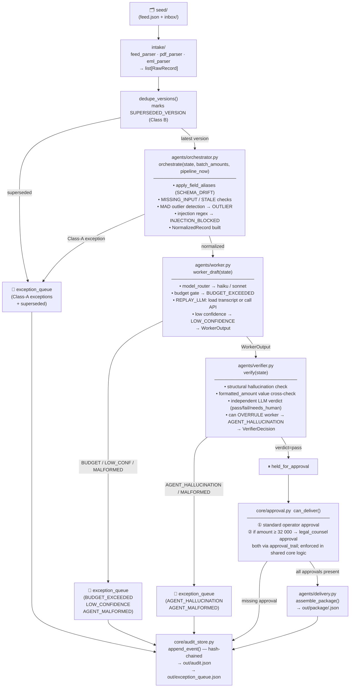

# ARCHITECTURE.md — CEDX-DCB8F2

## Agent Topology



## State Flow

`PipelineState` (Pydantic, immutable) threads through every agent. Each agent calls `state.model_copy(update={...})` — never mutates in place.

```
PipelineState
  ├── raw: RawRecord           # intake output, never modified
  ├── normalized: NormalizedRecord | None   # orchestrator output
  ├── worker_output: WorkerOutput | None    # worker output
  ├── verifier_decision: VerifierDecision | None
  ├── exception: ExceptionRecord | None     # first fault that blocked the record
  ├── approval_trail: list[ApprovalEntry]
  ├── audit_trail: list[AgentTrace]         # one span per agent call
  ├── step_count: int                       # AGENT_LOOP guard
  ├── total_cost_usd: float                 # running cost tally
  └── status: "processing" | "held_for_approval" | "delivered" | "exception" | "superseded"
```

## Component Map

| Layer | File | Purpose |
|-------|------|---------|
| Intake | `intake/feed_parser.py` | Parse JSON feed → `list[RawRecord]` |
| Intake | `intake/pdf_parser.py` | Extract fields from PDF attachments |
| Intake | `intake/eml_parser.py` | Extract fields from .eml email files |
| Agent | `agents/orchestrator.py` | Normalize, detect all Class-A/B problems |
| Agent | `agents/worker.py` | LLM draft with model routing + transcript replay |
| Agent | `agents/verifier.py` | Independent structural + LLM quality check |
| Agent | `agents/delivery.py` | Assemble branded output package |
| Core | `core/models.py` | All Pydantic schemas — single source of truth |
| Core | `core/model_router.py` | haiku/sonnet selection policy + cost estimation |
| Core | `core/graph.py` | Plain-Python pipeline dispatcher (orchestrator→worker→verifier) |
| Core | `core/approval.py` | `can_deliver()` gate — amendment-aware, shared by all callers |
| Core | `core/audit_store.py` | Hash-chained append-only event log |
| Core | `core/state_store.py` | Idempotency ledger keyed by (source_hash, pipeline_version) |
| Core | `core/transcripts.py` | Content-addressed transcript store + lookup index |
| Core | `core/hashing.py` | Canonical JSON → SHA-256 (used everywhere hashes are required) |
| API | `cli.py` | Single entrypoint: demo · approve · reject · deliver · trace · replay |
| Eval | `eval/run_eval.py` | 15 golden cases testing orchestrator, router, verifier |
| Probes | `probes/probe_approval.py` | Delivery gate enforcement |
| Probes | `probes/probe_agent_failure.py` | Hallucination detection |
| Probes | `probes/probe_budget.py` | Cost ceiling enforcement |
| Probes | `probes/probe_append_only.py` | Audit log tamper detection |
| Probes | `probes/probe_idempotency.py` | No-duplicate second-run guarantee |

## Key Design Decisions

- **No LangGraph / FastAPI / Postgres** — pure Python 3.11 + Pydantic. Simpler dependency surface, easier to reason about ordering guarantees.
- **Content-addressed transcripts** — transcript files are named by `sha256(response)`, not by record ID. This makes integrity verification O(1) per file: the filename IS the hash.
- **Shared `can_deliver()` gate** — approval enforcement lives in `core/approval.py`, not in the CLI. Every caller (CLI, probes, future API) goes through the same function.
- **MAD outlier detection** — generalizes to any batch distribution without needing hardcoded thresholds.
- See `DECISIONS.md` for the full rationale.
